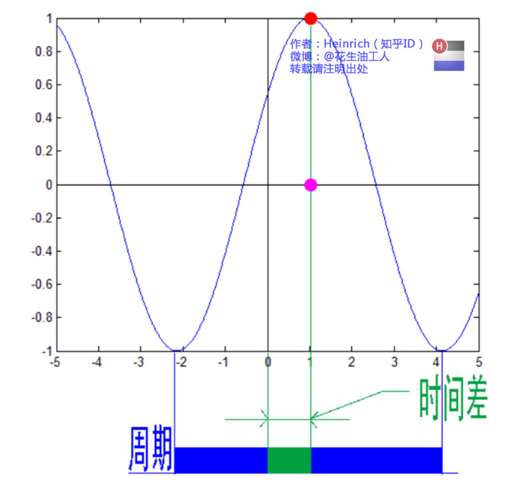

[参考资料](https://zhuanlan.zhihu.com/p/19763358)
# 傅立叶级数

## 频域分析

傅立叶级数就是将周期函数的和分别往频域方向投影，就只剩一根垂线段了。

## 相位谱

频率轴开始第一个波峰到频率轴的距离就是时间差。

时间差不是相位，$相位=\frac{时间差}{周期}\times2\pi$

# 傅立叶变换

傅立叶变换就是从正弦波离散的和到对正弦波的积分变换。

这个是离散的傅立叶级数，这个是离散和。

这个是对傅立叶级数的积分，就是面积（不好看）。

## 利用欧拉公式使得图像更好看
$e^{it}=cos(t) + isin(t)$

欧拉公式就是在实数-虚数-时间三维坐标系中，就是一个立体螺旋线。

该螺旋形在实数-时间坐标系下的投影就是一个余弦波。

对这个公式的积分变换如下图：

